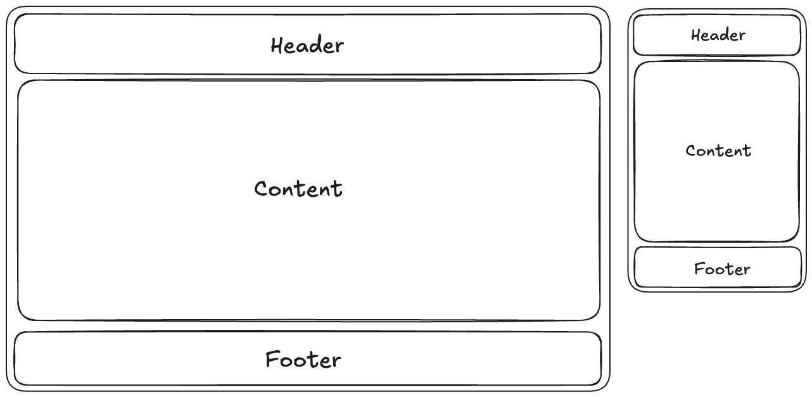
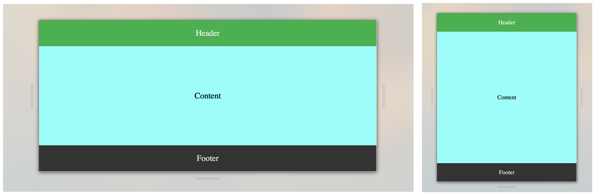

I have recently worked on several projects where I extensively used Flexbox for front-end layout. I found it incredibly useful and would like to share some tips through this article.

## What is flexbox

> Flexbox is a one-dimensional layout method for arranging items in rows or columns. Items flex (expand) to fill additional space or shrink to fit into smaller spaces. -- [MDN Web Docs](https://developer.mozilla.org/en-US/docs/Learn_web_development/Core/CSS_layout/Flexbox)

## Why using flexbox

Think about when you are trying to arrange an element at the **vertical** and **horizontal** center of a page, what will you do?

**One classic way is using Absolute Positioning.**

```html
<div class="parent-container">
  <div class="child-element">
    I'm centered!
  </div>
</div>
```

```css
.parent-container {
    position: relative;
    height: 100vh;
    background-color: #f0f0f0;
}

.child-element {
    position: absolute;
    top: 50%;
    left: 50%;
    transform: translate(-50%, -50%);
}
```

This method is absoulately ok, but the way it works is:

1. Set the parent container's position to `position: relative;`.
2. Set the child element's position to `position: absolute;`.
3. Move the child element's top and left edges to the 50% mark of the parent: `top: 50%;` and `left: 50%;`. This aligns the top-left corner of the child with the center of the parent.
4. Use `transform: translate(-50%, -50%);` to shift the child element back up and to the left by half of its own width and height, perfectly aligning its center with the parent's center.

**This is not that intuitive** 😩

### See the flexbox way below

```html
<div class="flex-element">I'm centered!</div>
```

```css
.flex-element {
    height: 100vh;
    display: flex;
    justify-content: center;
    align-items: center;
}
```

Instead using a parent element, flexbox can do it by itself.

1. Set the flex element to fill the whole viewport `height: 100vh;`.
2. Set the display attribute to flex `display: flex;`.
3. Set the element vertically center `justify-content: center;`.
4. Set the element horizontally center `align-items: center;`.

**This is much more intuitive and readable!** 🎉

## Another powerful thing in flexbox



You are making a website that requires responsive design, the header and the footer are fixed to the top and bottom respectively, and you want your content between them to be '**fitted**'.

In this case you can not set a fixed height for the content since the height of different devices varies, and here is the example how you can tackle this problem easily in flexbox.

```html
<body>
    <header class="nav">Header</header>
    <div class="content">Content</div>
    <footer class="footer">Footer</footer>
</body>
```

```css
body,
html {
    margin: 0;
    padding: 0;
    height: 100dvh;
    display: flex;
    flex-direction: column;
}
.nav {
    background-color: #4caf50;
    color: white;
    text-align: center;
    padding: 1em;
}
.content {
    display: flex;
    justify-content: center; /* Center horizontally */
    align-items: center; /* Center vertically */
    background-color: #9efdf8;
    flex: 1;
}
.footer {
    background-color: #333;
    color: white;
    text-align: center;
    padding: 1em;
    bottom: 0;
}
```

**Below is the final effects.**



As you can see here, the content is fit the space between header and footer. And you can find `flex: 1;` in css, this means in a flexbox the content itself will calculate the rest of the space and fill it up.

### Understanding `flex: 1` in depth

The `flex: 1;` property is actually a shorthand for three properties:

- `flex-grow: 1` - Allows the item to grow to fill available space
- `flex-shrink: 1` - Allows the item to shrink if necessary
- `flex-basis: 0` - Sets the initial size before space distribution

In our example, when we apply `flex: 1` to the content section:

1. The header and footer take up their natural height based on their content
2. The content section then calculates: "What's the remaining space?"
3. It automatically grows to fill that entire remaining space
4. On different screen sizes, it dynamically adjusts without any manual calculations

This is particularly powerful because:

- **No hardcoded heights needed** - The layout adapts automatically
- **Works on any device** - From mobile phones to ultra-wide monitors
- **Maintains proportions** - If you have multiple flex items with different flex values, they'll share space proportionally

For example, if you had two content sections with `flex: 1` and `flex: 2`, the second would take twice as much space as the first, with both still being responsive!

## Key advantages of Flexbox

Flexbox brings several powerful benefits to modern web layouts:

**1. Simplicity and Readability**
The code is self-explanatory. When you see `display: flex` with `justify-content` and `align-items`, you immediately understand the layout intention without having to mentally calculate offsets or transformations.

**2. Responsive by Nature**
Flexbox automatically adapts to different screen sizes. Items can grow, shrink, and wrap based on available space without complex media queries or JavaScript calculations.

**3. One-Dimensional Power**
While Grid excels at two-dimensional layouts, Flexbox is perfect for one-dimensional arrangements (either rows or columns). This makes it ideal for navigation bars, card layouts, form controls, and toolbar arrangements.

**4. Alignment Control**
Both main-axis (`justify-content`) and cross-axis (`align-items`) alignment become trivial. You can easily:

- Center elements vertically and horizontally
- Distribute space evenly between items
- Align items to start, end, or center
- Stretch items to fill available space

**5. Order Independence**
You can change the visual order of elements without changing the HTML structure using the `order` property, which is excellent for responsive designs where layout priorities shift.

## Quotation

- [A guide to flexbox](https://css-tricks.com/snippets/css/a-guide-to-flexbox)
- [MDN Web Docs](https://developer.mozilla.org/en-US/docs/Learn_web_development/Core/CSS_layout/Flexbox)
