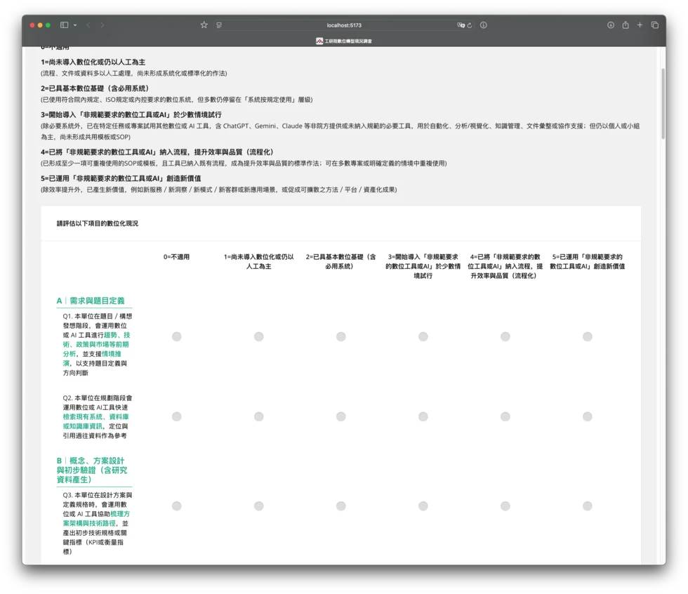
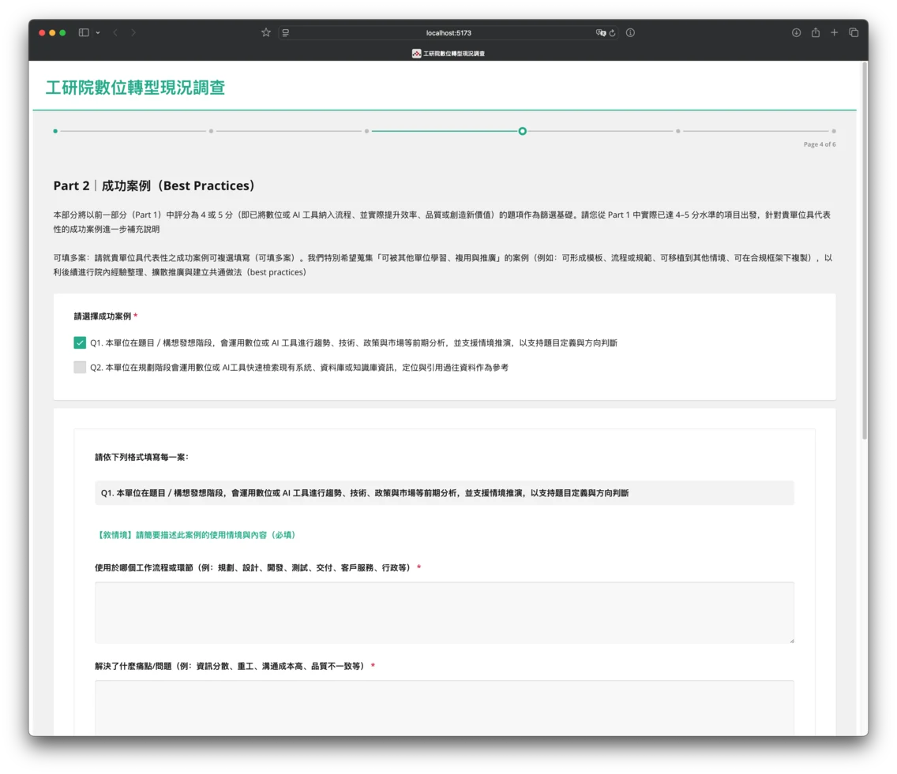
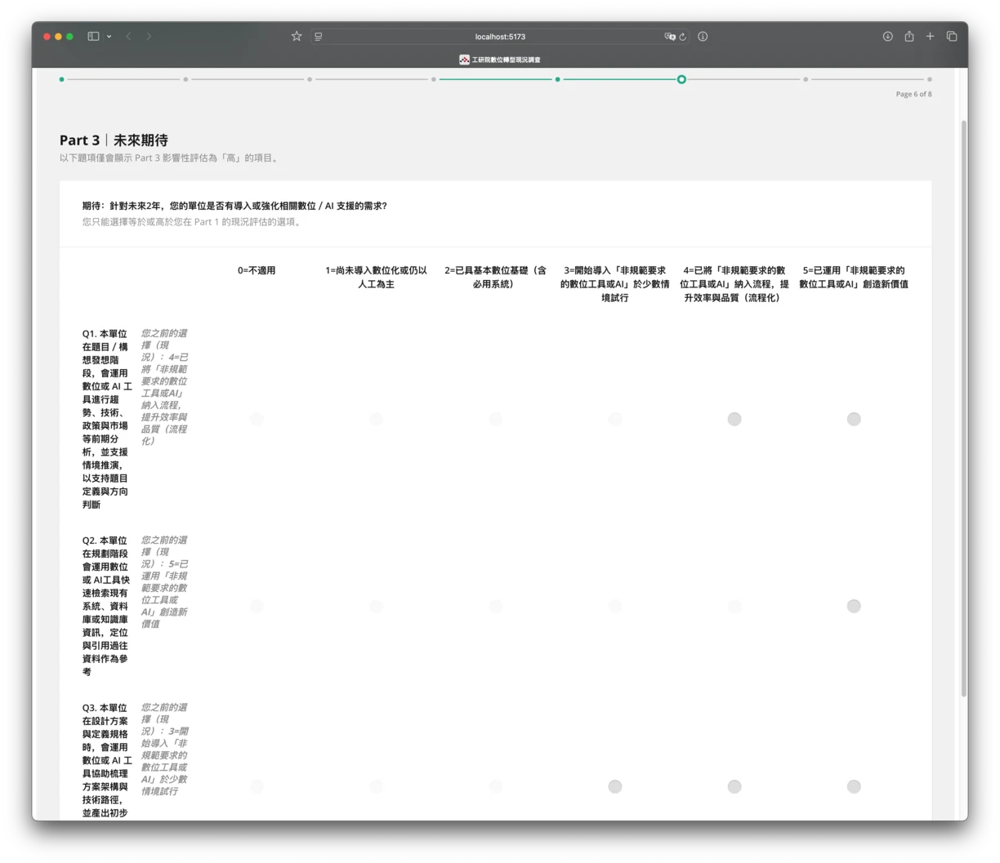
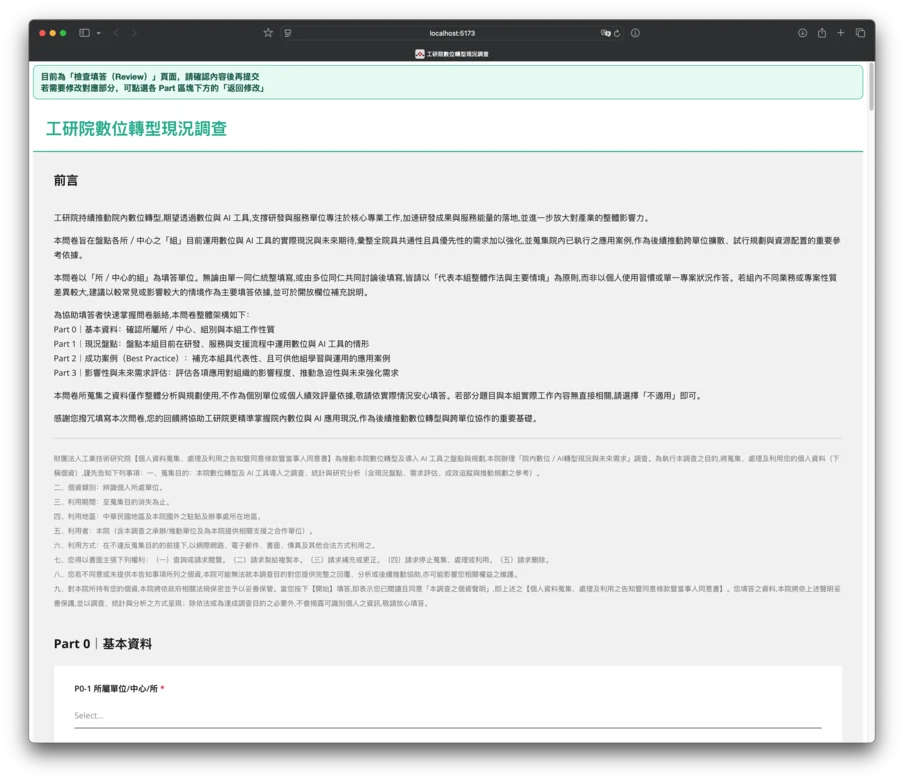

import CodeBlockWithCopy from "@/components/common/CodeBlockWithCopy.astro";

This project is an internal survey system designed to capture current digital/AI maturity across teams, collect reusable best practices, and identify high-impact priorities for the next phase of transformation.

## What I Built

- A multi-part survey flow with SurveyJS, including introduction, baseline data, current-state assessment, best-practice collection, impact/urgency scoring, and final suggestions
- A fully dynamic questionnaire model generated from configuration/data files (`questionList`, scale options, unit/group mappings), so business rules can be updated without rewriting UI pages
- Conditional logic for visibility, required fields, and branching (for example, Part 2 appears only when high-maturity items are selected)
- A review-before-submit experience (`showPreviewBeforeComplete`) with explicit guidance for editing before final submission
- Frontend-to-backend submission pipeline with payload validation and persistent storage

## Key Technical Highlights

- **Fixed scale header on long matrix questions**: implemented a custom fixed header hook (`useP1FixedScaleHeader`) so scoring columns stay visible while users scroll through large matrix tables
- **Dynamic “Other” row title sync**: matrix row labels auto-update from comment inputs (for Q28/Q29) to keep review data readable and traceable
- **Input consistency safeguards**: unit/group dependency rules prevent invalid selections when users change upstream fields
- **Backend validation + metadata capture**: Zod schema validation, plus request metadata (user agent, referer, country) for audit and analytics
- **Cloudflare-native deployment path**: Workers + D1 + Drizzle migration scripts, with CORS controls via environment config

## Architecture

| Layer      | Stack                                       | Responsibilities                                             |
| ---------- | ------------------------------------------- | ------------------------------------------------------------ |
| Frontend   | React 19 + TypeScript + Vite + SurveyJS     | Dynamic survey rendering, branching, review mode, submission |
| API        | Hono on Cloudflare Workers                  | JSON parsing, validation, metadata extraction, routing       |
| Data       | Cloudflare D1 + Drizzle ORM                 | Survey response schema, insertion, migrations                |
| Validation | Zod                                         | Request contract enforcement                                 |
| Deployment | Wrangler + Cloudflare Pages/Workers scripts | Worker deploy, DB migration, frontend build and publish      |

## Screenshots

## Outcome

This system turned a complex institute-level questionnaire into a maintainable product: survey logic is configuration-driven, the UX supports long-form matrix scoring with better readability, and collected data is reliably stored through a typed backend pipeline that is ready for future analytics and reporting.
