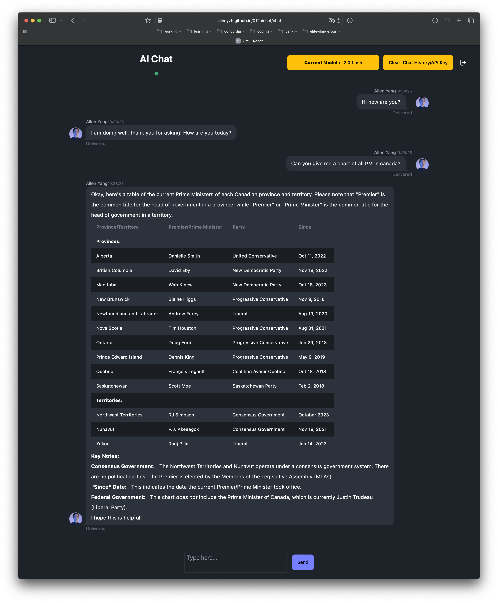

import PostButton from "@/components/common/PostButton";

<PostButton
  items={[
    { href: "https://allenyzh.github.io/012aichat/", type: "demo" },
    { href: "https://github.com/Allenyzh/012aichat", type: "code" },
  ]}
/>

This is a chatbot application leveraging Gemini model, built with React. It features a user-friendly interface styled with Tailwind CSS and DaisyUI, providing an engaging chat experience. The app allows users to interact with the Gemini model seamlessly, making it easy to ask questions and receive responses in real-time.

## Features

- streaming responses for real-time interaction
- user-friendly interface with Tailwind CSS and DaisyUI
- easy integration with Gemini model
- responsive design for various devices

