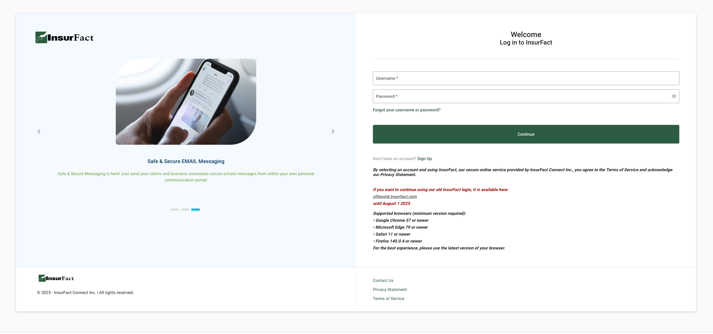

import PostButton from "@/components/common/PostButton";

<PostButton
  items={[{ href: "https://cfiles.insurfact.com/C2U-2.5/", type: "demo" }]}
/>

Contributed to the modernization of a 20-year-old enterprise platform by building a new, responsive, and mobile-friendly web application. The project aimed to reimagine the legacy system with modern technologies while preserving its reliability and long-term stability

## Key Contributions:

- Fixed and built UI using Vue.js and JSF
- Resolved legacy front-end issues to improve performance and maintainability
- Implemented i18n internationalization, supporting multiple languages
- Created custom component wrappers to streamline and standardize the UI
- Delivered a mobile-first experience optimized for all devices

