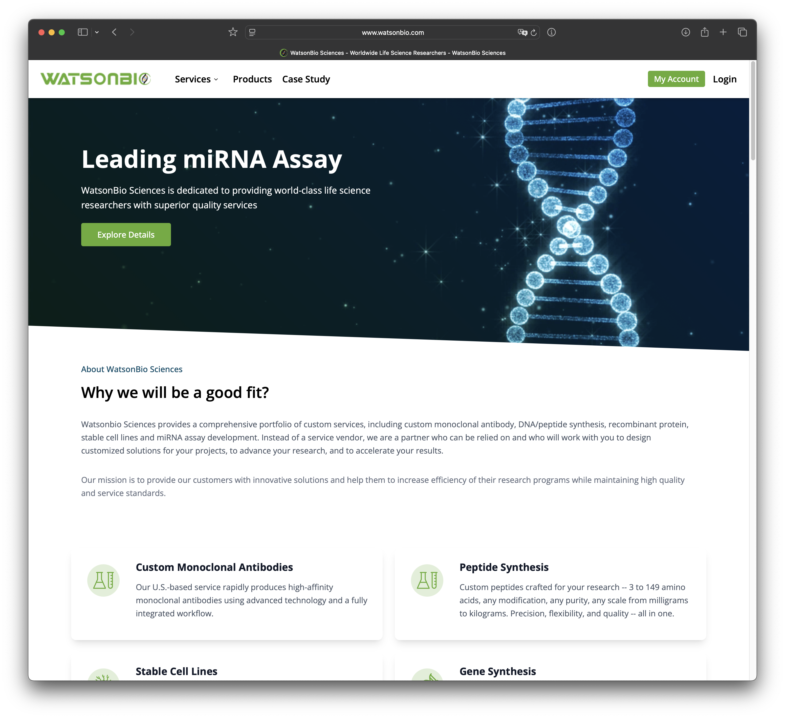

import PostButton from "@/components/common/PostButton";

<PostButton items={[{ href: "https://www.watsonbio.com/", type: "demo" }]} />

The WatsonBio Sciences website is a modern, comprehensive web platform for a biotechnology services company specializing in custom solutions for biomedical and pharmaceutical research. Built with Astro framework and integrated with React components, this project delivers a seamless user experience with full-featured online service capabilities.

Key achievements:

- React Components: Built reusable components for efficiency.
- Integrating Shadcn to build a modern and user friendly UI
- Using Astro file cms to deliver a better content based website
- Implementing new backend cms system for easy content management

